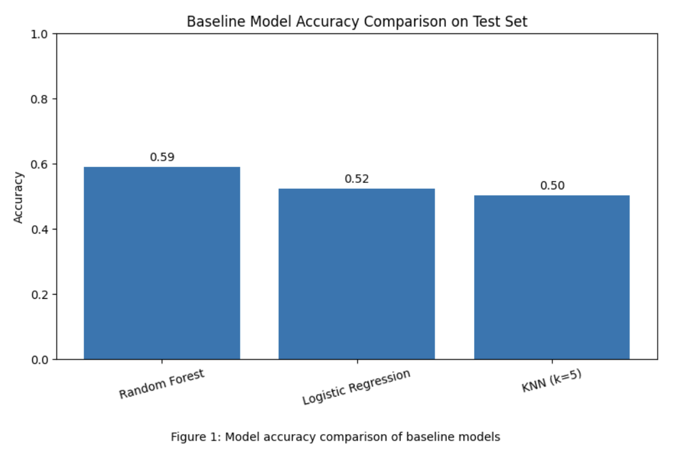
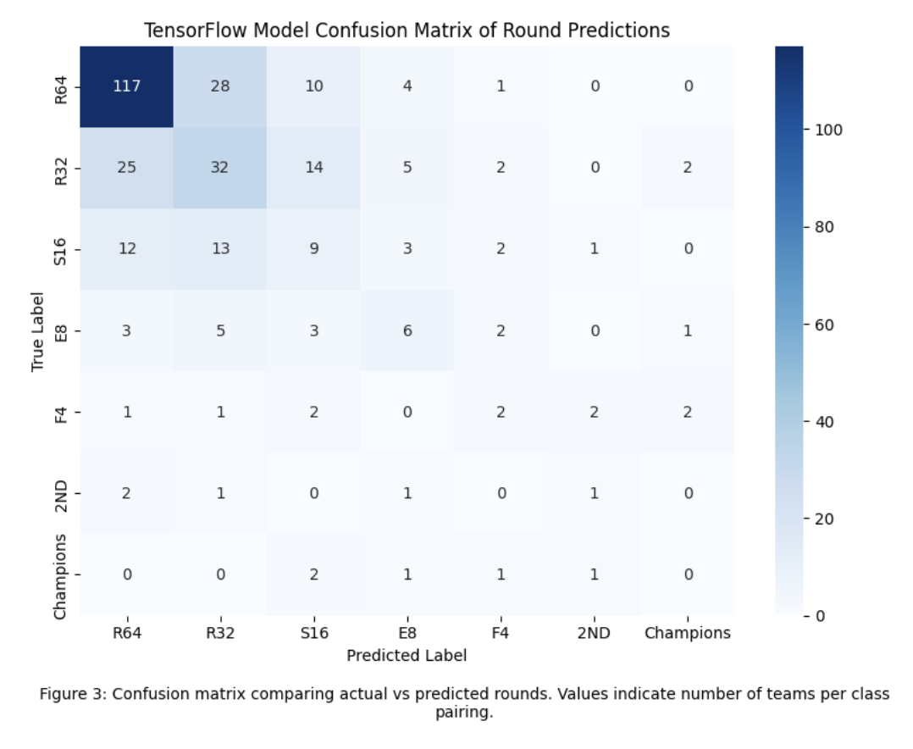
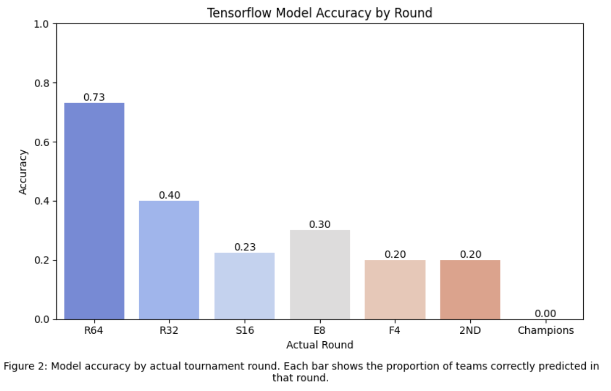
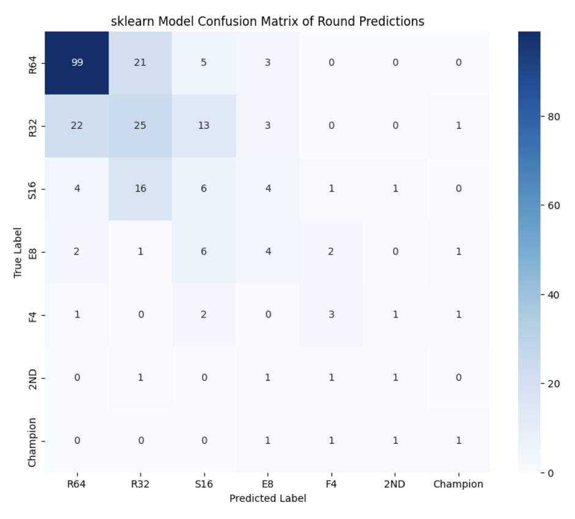
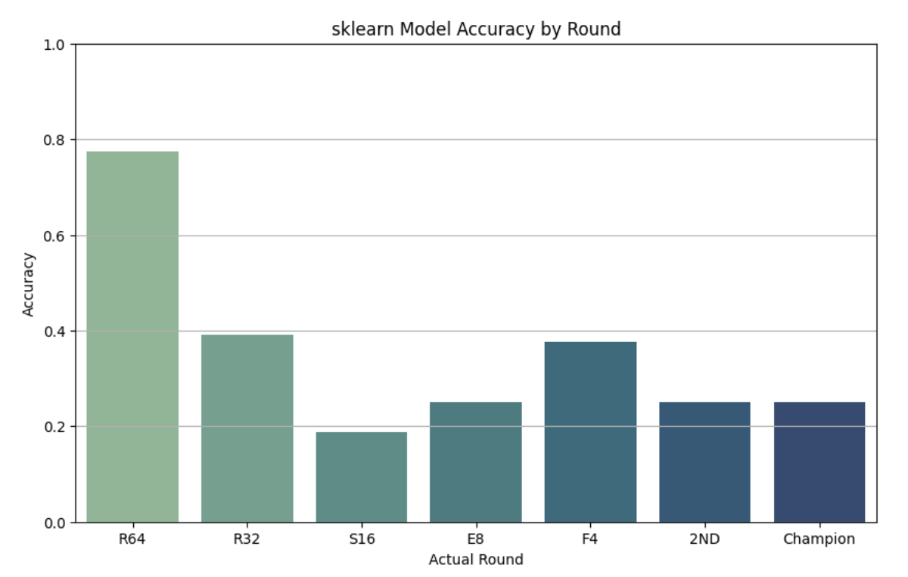

# Artificial Neural Networks March Madness Project
The purpose of this project was to predict the NCAA Men's Tournament postseason results for each of the 64 teams in Round 1, leading to an eventual predicted champion.

Link to Blog Post: https://medium.com/@owen.short_11894/march-madness-neural-networks-d2cd66b739e5

Link to Blog Figures: 

